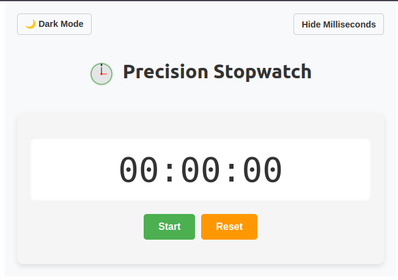
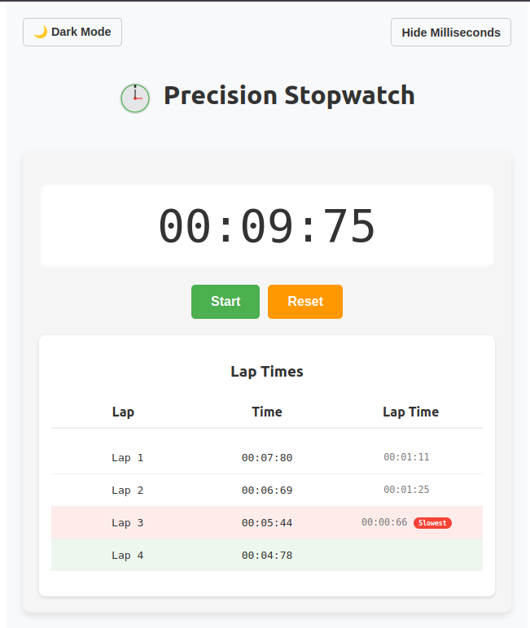
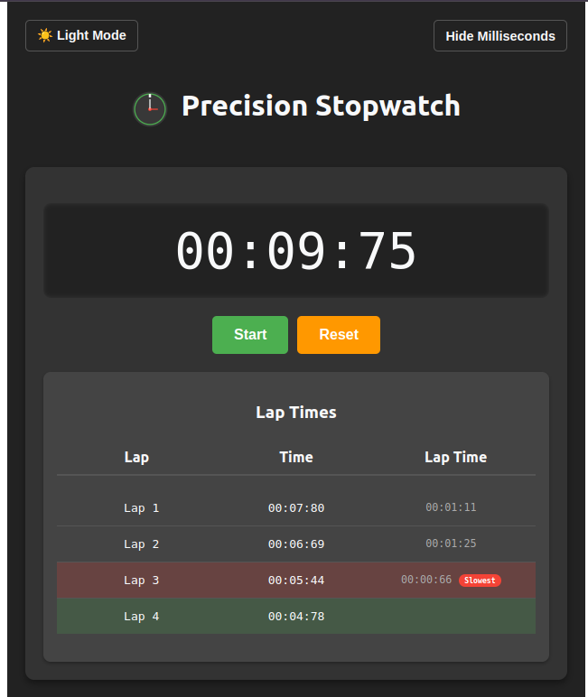

# ⏱️ Precision Stopwatch

A modern, feature-packed stopwatch built with **React** and **Tailwind CSS**. Easily start, stop, and track laps with millisecond precision. Includes lap analytics with fastest and slowest lap indicators, as well as theme toggling and optional millisecond display.

---

## ✨ Features

- 🕒 **Accurate Stopwatch** – Tracks time in milliseconds with precision.
- 🏁 **Lap Functionality** – Save and view lap times with lap-to-lap comparisons.
- ⚡ **Best/Worst Laps** – Automatically highlights your fastest and slowest laps.
- 🌗 **Theme Toggle** – Switch between light and dark mode.
- 🔍 **Custom Display** – Option to show/hide milliseconds.
- 📱 **Responsive Design** – Clean UI for both mobile and desktop.

---

## 🚀 Tech Stack

- **Frontend**: React
- **Styling**: Tailwind CSS
- **State Management**: React Hooks

---

## 📦 Installation

1. **Clone the repository**:
   ```bash
   git clone https://github.com/Samuel-Hailemariam-Seifu/stop-watch.git
   cd stop-watch
   ```

2. **Install dependencies**:
   ```bash
   npm install
   ```

3. **Run the development server**:
   ```bash
   npm start
   ```

Visit the app in your browser at `http://localhost:3000`.

---

## 📸 Screenshot

Here’s what the app looks like in action:






---

## 🗂️ Project Structure

```
src/
├── App.js           # Main stopwatch component
├── App.css          # Custom styles
├── index.js         # App entry point
├── ...


---

## 🛠 Available Scripts

- `npm start` – Runs the app in development mode.
- `npm run build` – Builds the app for production.
- `npm test` – Launches the test runner.
- `npm run eject` – Ejects the app from Create React App (⚠️ irreversible).

---

## 🤝 Contributing

Contributions are welcome!  
Feel free to fork the repo and submit pull requests.

